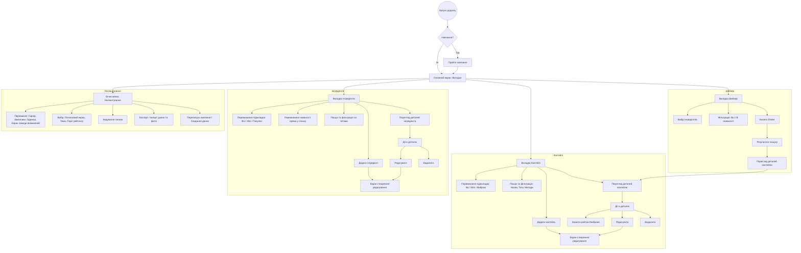

# Можливі дії користувача в YourBar

Цей документ містить опис основних функцій та дій користувача в додатку YourBar.

## Діаграма дій

## Основні функції

### 1. Керування Коктейлями
*   **Перегляд списку:** Користувач може переглядати всі коктейлі, тільки доступні (Мої) або вибрані.
*   **Пошук та фільтрація:** Можливість швидкого пошуку за назвою та фільтрація за тегами (напр. "Класика", "Міцний") та методами приготування (напр. "Shake", "Stir").
*   **Створення та редагування:** Користувач може додавати власні рецепти, вказуючи назву, інгредієнти, кроки приготування, теги та додаючи фото.
*   **Вибране:** Можливість ставити рейтинг коктейлям. У меню налаштувань можна задати поріг рейтингу для відображення у вкладці "Вибрані".

### 2. Керування Інгредієнтами (Інвентар)
*   **Наявність:** Швидке перемикання статусу інгредієнта (є в наявності чи ні).
*   **Список покупок:** Можливість додавати інгредієнти до списку покупок для майбутнього поповнення бару.
*   **Брендування:** Можливість вказувати конкретні бренди інгредієнтів, які є в наявності.

### 3. Режим "Шейкер"
*   Дозволяє вибрати інгредієнти, які ви хочете використати зараз, та знайти коктейлі, які можна з них приготувати.
*   Результати показують як ті коктейлі, що можна приготувати повністю, так і ті, для яких не вистачає лише кількох інгредієнтів.

### 4. Налаштування та Дані
*   **Персоналізація:** Налаштування теми додатку (світла/темна/системна), одиниць виміру (ml/oz) та початкового екрану.
*   **Керування тегами:** Створення та редагування власних тегів для коктейлів та інгредієнтів.
*   **Резервне копіювання:** Експорт та імпорт даних бару у форматі JSON, а також резервне копіювання фотографій у форматі TAR.
*   **Навчання:** Можливість перезапустити тур додатком у будь-який момент.
